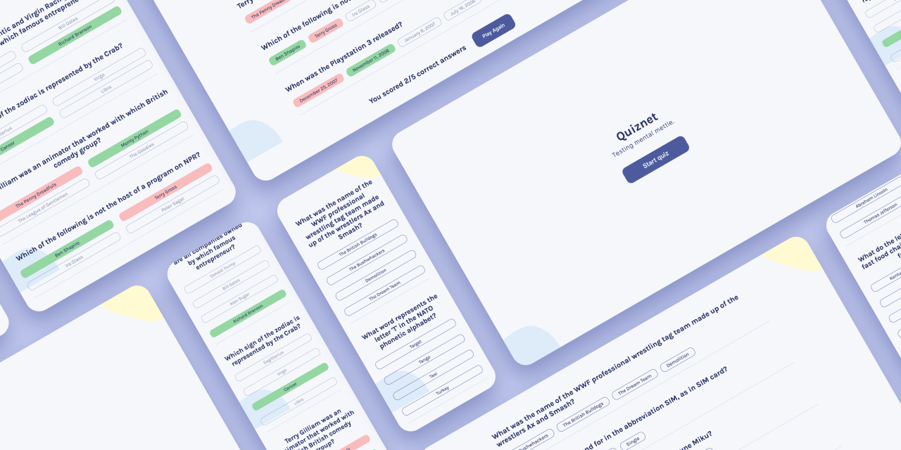

# Quiznet

<!-- BACKGROUND -->

**Quiznet** is a small quiz application, built from scratch with the help of designs from Scrimba.

<!-- FEATURES -->

## Roadmap

- [x] Start page
- [x] Quiz page
- [x] Fetch questions from [API](https://opentdb.com/api_config.php)
- [x] Check Answers
- [x] Display Results
- [x] Mobile responsive

See the [open issues](https://github.com/sf-adams/quiznet/issues) for a full list of proposed features (and known issues).

<!-- To view the demo: click here -->

<!-- GETTING STARTED -->

## Getting Started

The first step is to fork a copy of the Quiznet repository to your own account. Follow the [official instructions](https://docs.github.com/en/get-started/quickstart/fork-a-repo) from GitHub.

After completing that step, in the command line:

1. Clone your new repo by typing `git clone https://github.com/YOUR-USERNAME/quiznet.git`
2. Then type `cd quiznet` to go into the project's directory
3. Install the dependencies with `npm install`
4. Run the project with `npm start`
5. Quiz time!

<!-- AUTHOR/CONTACT -->

## Author

[![Portfolio][portfolio-shield]][portfolio-url]
[![LinkedIn][linkedin-shield]][linkedin-url]
[![Medium][medium-shield]][medium-url]
[![YouTube][youtube-shield]][youtube-url]

[portfolio-shield]: https://img.shields.io/badge/Portfolio-FFD300?style=for-the-badge&logo=aboutdotme&logoColor=242424
[portfolio-url]: https://sf-adams.com
[linkedin-shield]: https://img.shields.io/badge/LinkedIn-FFD300?style=for-the-badge&logo=linkedin&logoColor=242424
[linkedin-url]: https://linkedin.com/in/sf-adams
[medium-shield]: https://img.shields.io/badge/Medium-FFD300?style=for-the-badge&logo=medium&logoColor=242424
[medium-url]: https://medium.com/@sf-adams
[youtube-shield]: https://img.shields.io/badge/YouTube-FFD300?style=for-the-badge&logo=youtube&logoColor=242424
[youtube-url]: https://youtube.io/sf-adams

<!-- LICENSE -->

## License

This project is licensed under the MIT License - see the [LICENSE.md](LICENSE.md) file for details

<!-- ACKNOWLEDGMENTS -->

## Acknowledgements

This project was designed by [Scrimba](https://www.passmedicine.com/), which gave me a clear idea of what the desktop design should look like.

Other inspiration, references and honourable mentions include:

- [html-entities](https://www.npmjs.com/package/html-entities)
- [Open Trivia API](https://opentdb.com/api_config.php)

(<a href="#readme-top">Back to Top</a>)

